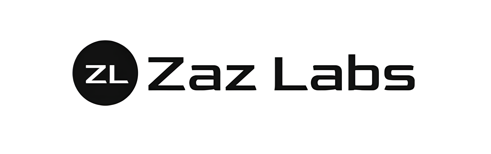

<!-- PROFILE HEADER -->
<h1 align="center">Hey, I'm Ezaz — building human-level assistants & wearables 👋</h1>

  Founder @ <b>Zaz Labs</b> • SF Bay Area • AI + Systems • Ex-Berkeley Lab Research

  <a href="https://zaz-three.vercel.app" target="_blank">🌐 Portfolio</a> •
  <a href="https://www.linkedin.com/in/ezaz-ahamad-821386229/" target="_blank">LinkedIn</a> •
  <a href="https://www.youtube.com/@ezazahamad7520" target="_blank">YouTube</a> •
  <a href="https://github.com/ezazahamad2003" target="_blank">GitHub</a> •
  <a href="https://www.instagram.com/zaz_labs/" target="_blank">Instagram</a>

---

<!-- HERO / BANNER -->

  

## 🚀 What I'm building
- **Calex** — personal AI wearable + deep memory layer (text + audio + vision) for real-time assistance, The future.
- **AERO** — Automatic Execution & Reaction Orchestrator (instant action agent for desktop & web)  
- **Pregame.club** — AI networking for events (10k+ users)  
- **Natsu AI / DehaAI / Wellia** — healthcare + eldercare case-manager agents with secure local memory

> Mission: make AI that *remembers like a second brain* and *acts* like a real teammate

## 🧪 Research & interests
- Multi-modal encoders • on-device inference • CUDA/OMP acceleration  
- Graph-RAG + long-horizon "Deep Memory DAGs"  
- Agentic workflows (tools, UI control, Zoom/Calendar/Trello) with low latency and high reliability

## 🛠️ Stack I reach for
**Lang/ML:** Python, C/C++, CUDA, RAPIDS, cuDF, cuML, XGBoost  
**Agents/LLMs:** Gemini, OpenAI, Anthropic, Flask/FastAPI, LangChain, Agent memory
**Frontend:** React, Next.js, Tailwind, Flutter  
**Cloud/Infra:** GCP, AWS, Firebase (Auth/Firestore/Hosting), Docker  
**Data/Vis:** Pandas/Polars, Tableau/PowerBI

## 🏗 Featured projects
| Project | Demo / Repo | Brief |
|---|---|---|
| **Calex** | (soon) | Wearable + deep memory; on-device capture of life data; retrieval + action |
| **AERO** | aero-bho2-nafiulkhalids-projects.vercel.app | Instant action agent that controls apps, meetings, notes, and system |
| **Pregame.club** | preseed GTM | AI networking for events; profiles, smart intros, gallery, analytics |
| **Natsu AI (Wellia)** | (in dev) | Med case manager with voice reminders and secure local data |

> Want to collaborate on **agent-to-agent** workflows or **on-device memory**? DM me.

## 📚 Recent highlights
- 2× research publications (network orchestration + ML)  
- Ex-researcher at **Berkeley Lab**  
- Founding Engineer @ **Odero Energy Solutions**  
- Author: *The 100th Sonnet*

## 🔗 Quick links
- Portfolio: **https://zaz-three.vercel.app**
- LinkedIn: **/in/ezaz-ahamad-821386229/**
- YouTube: **@ezazahamad7520**
- Instagram: **@zaz_labs**

---

### ⚡ GitHub stats (because why not)

  
  

<!-- FOOTER BADGES -->

  
  

<!--
Notes:
- Swap banner URL with any image from your site (hosted on Vercel). Keep width ~900.
- Add repos once public (Calex, AERO, etc.) to the table above.
- Keep it simple; update quarterly.
-->
